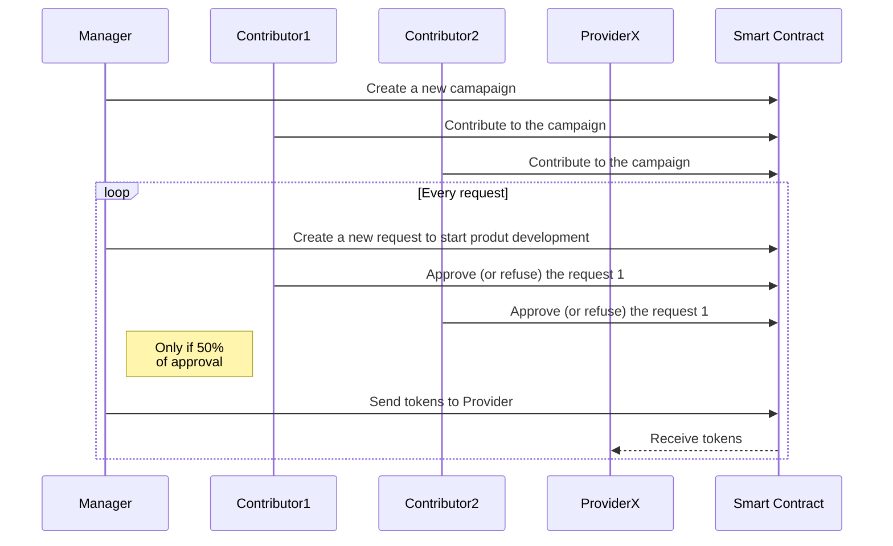

# Coin starter

Web3 sample project to intereact between a react application (NextJs) and a smart contract hosted on a ethereum blockchain (solidity).

## Stack

- React (Nextjs)
- Semantic-ui
- Mocha
- Solidity (0.8.11)
- Web3 library
- MetaMask
- Truffle
- Ganache
- Adobe Free random logo generator

## High Level Design



## Ethereum side (Smart Contract)

> Please use nodeJS 14 or higher

- Install packages with `npm i`

### How to deploy locally (ganache)

- Download and install first Ganache from [here](https://trufflesuite.com/ganache/index.html) and start it
- Run `npm run compile` to compile contracts
- Run `npm run migrate` to move contracts to local ganache

> Truffle has a embedded blockchain but ganache has a nice interface, making transactions/users/contracts validation easier. `truffle-config.js` is already set to target Ganache by default, nothing to do on your side.

> If you do some change to your contract and want to redeploy them as new contract, use `npm migrate-reset`

_Ganache preview:_


### How to run tests

Run `npm run dev`

> Truffle feature are not used for tests (`contract()`), only standart mocha tests.

### How to deploy on Rindekin (infura):

WIP

## FE side (Nextjs)

### Prepare your browser

You need to install Metamask extension on your browser

**please never use your real wallet for that .... install it on a different browser, just to avoid any risk.**

Add the local blockchain network in MetaMask by entering the RPC URL and Chain ID. Default Value are http://127.0.0.1:8545 and 1337 respectively.


Be sure to select this network is selected :


### Setup

- Install packages with `npm run install-fe`
- Update the `NEXT_PUBLIC_FACTORY_ADDRESS` value in `kickstarter-fe/.env.local` with the Factory contract address (_available in the transactions tab of ganache_)
- Run `npm run start-fe` to start server on port 3000

Default value for .env.local :

```
NEXT_PUBLIC_FACTORY_ADDRESS=0x8151fbb7eee0b4aeC087b59581dc64d2badF699d
NEXT_PUBLIC_NODE_ADDRESS=http://127.0.0.1:7545
NEXT_PUBLIC_NETWORK_ID=5777
```

### How to run tests

Run `npm run test-fe` to run unit tests of components.

Because of the complexity of mocking Metamask, no e2e tests (cypress,etc.).

## How to participate

Feel free to create PR to the master branch. Github Actions is used to run the solidity and FE tests. All checks need to be green before asking for a review.

Any comments , bugs tickets are also welcome !

## Screen captures

### Top page


### Campaigns top


### Campaign Details


### Request


