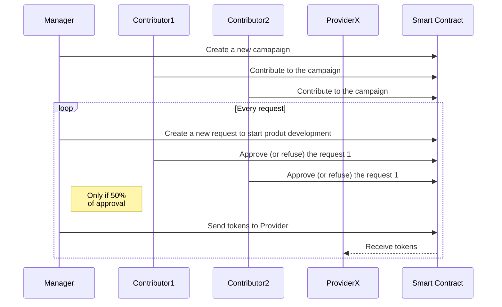
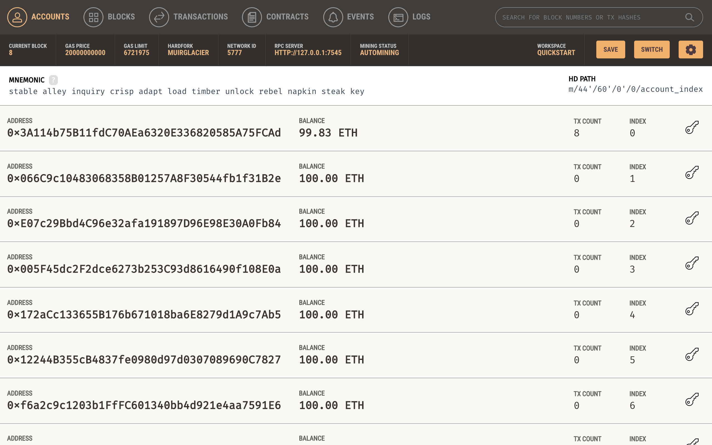

# Kickstarter application sample

Web3 sample project to intereact between a react application (NextJs) and a smart contract hosted on a ethereum blockchain (solidity).

## stack

- React (Nextjs)
- Semantic-ui
- Mocha
- Web3 library
- MetaMask
- Truffle
- Ganache

## High Level Design

## Ethereum side (Smart Contract)

### Setup

- Install packages with `npm i`

### How to deploy locally (ganache)

- Download and install first Ganache from [here](https://trufflesuite.com/ganache/index.html) and start it
- Run `npm run compile` to compile contracts
- Run `npm run migrate` to move contracts to local ganache

> Truffle has a embedded blockchain but ganache has a nice interface, making transactions/users/contracts validation easier. `truffle-config.js` is already set to target Ganache by default, nothing to do on your side.

_Ganache preview:_

### How to run tests

Run `npm run dev`

> Truffle feature are not used for tests (`contract()`), but

### How to deploy on Rindekin (infura):

WIP

## FE side (Nextjs)

### Setup

- Install packages with `npm run install-fe`
- Run `npm run start-fe` to start server on port 3000

### How to run tests

Run `npm run test-fe`
